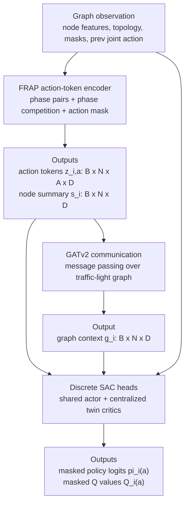
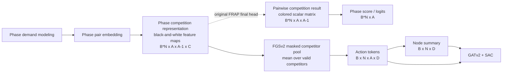

# FGSv2

FGSv2 is a FRAP-GNN-SAC variant that keeps FRAP's phase-competition structure as
action tokens before graph communication. It is intended for heterogeneous
traffic-signal networks where intersections can have different valid phase
counts under one padded shared-policy action space.

## Architecture

For a batch of graph observations, the wrapper supplies:

```text
node_features:           [B, N, F]
node_action_mask:        [B, N, A]
phase_pair_mask:         [B, N, A, M]
phase_competition_mask:  [B, N, A, A - 1]
prev_joint_action:       [B, N, A]
```

where `B` is batch size, `N` is the number of controlled traffic lights, `A` is
the padded maximum action count, and `M` is the padded maximum movement count.



## FRAP Tap Point

FGSv2 does not use the final FRAP phase-score head directly. In the original
FRAP figure, FGSv2 taps the black-and-white **phase competition representation**
block, before the colored **pairwise competition result** matrix and before the
final **phase score** vector.



Original FRAP applies a final `1x1` convolution to turn each competition feature
into one scalar pairwise result, then sums each action row over competitors:

```text
[B*N, A, A-1, C] -> [B*N, A, A-1] -> [B*N, A]
```

FGSv2 replaces that final scalar-scoring step with token extraction:

```text
[B*N, A, A-1, C] -> masked mean over competitors -> [B*N, A, C]
                   -> adapter + LayerNorm          -> [B*N, A, D]
                   -> reshape                      -> [B, N, A, D]
                   -> masked mean over actions      -> [B, N, D]
```

So, yes: relative to the FRAP diagram, FGSv2 uses the black-and-white feature
maps right before the colored pairwise-result matrix. The colored matrix is
what original FRAP would use to get phase scores; FGSv2 instead keeps richer
competition features and turns them into action tokens and node summaries.

## Mathematical Pipeline

Let $x_i \in \mathbb{R}^F$ be the local observation for traffic light $i$,
$P_i \in \{0, 1\}^{A \times M}$ the phase-pair mask, $m_i \in \{0, 1\}^A$ the
valid-action mask, and $E$ the traffic-light graph edges. FGSv2 first maps each
node observation into FRAP action tokens, then communicates only the pooled node
summaries through GATv2.

For movement `u`, the encoder combines the current phase indicator and demand
features:

$$e_{i,u} =
\operatorname{ReLU}\left(
  W_{\text{lane}}
  \left[
    \sigma(\operatorname{Emb}_{\text{phase}}(p_{i,u})),
    \sigma(W_d d_{i,u})
  \right]\right)
$$

For candidate action `a`, the phase-pair mask selects the movements controlled
by that action. The implementation uses a scaled masked sum, which behaves like
a two-movement sum for normal phase pairs and a normalized fallback for padded
or heterogeneous phases:

$$
\phi_{i,a} = \sum_u w_{i,a,u} e_{i,u}
$$

$$
w_{i,a,u} =
P_{i,a,u}
\frac{
  \min\left(\sum_v P_{i,a,v}, 2\right)
}{
  \max\left(\sum_v P_{i,a,v}, 1\right)
}
$$

FRAP then compares every action with its ordered competitors. For competitor
`b != a`, relation features from `phase_competition_mask` modulate the phase
comparison:

$$
h_{i,a,b} =
\operatorname{ReLU}\left(
  \operatorname{Conv}_{\text{phase}}([\phi_{i,a}, \phi_{i,b}])
\right)
$$

$$
r_{i,a,b} =
\operatorname{ReLU}\left(
  \operatorname{Conv}_{\text{rel}}(\operatorname{Emb}_{\text{rel}}(R_{i,a,b}))
\right)
$$

$$
c_{i,a,b} =
\operatorname{ReLU}\left(
  \operatorname{Conv}_{\text{hidden}}(h_{i,a,b} \odot r_{i,a,b})
\right)
$$

Only valid competitors are pooled. If
$V_{i,a} = \{b \mid b \ne a,\ m_{i,a} = 1,\ m_{i,b} = 1\}$, the action token
and node summary are:

$$
z_{i,a} =
\operatorname{LayerNorm}\left(
  \operatorname{ReLU}\left(
    \operatorname{Adapter}\left(
      \frac{1}{|V_{i,a}|}\sum_{b \in V_{i,a}} c_{i,a,b}
    \right)
  \right)
\right)
$$

$$
z_{i,a} = 0 \quad \text{when } m_{i,a} = 0
$$

$$
s_i =
\operatorname{LayerNorm}\left(
  \frac{\sum_a m_{i,a} z_{i,a}}{\max(\sum_a m_{i,a}, 1)}
\right)
$$

The GATv2 stage communicates over the traffic-light graph using the node
summary, not the full action-token tensor:

$$
u_i = \operatorname{LayerNorm}(s_i)
$$

$$
\tilde{g}_i =
\operatorname{ReLU}\left(
  W_o\ \operatorname{GATv2Conv}(\{u_j \mid j \rightarrow i \in E \cup \{i\}\})
\right)
$$

$$
g_i = \operatorname{LayerNorm}(s_i + \alpha \tilde{g}_i)
$$

$\alpha$ is a learned scalar initialized by
`model_config.communication.residual_gate_init`. With the default $\alpha = 0$,
the initial graph context is the local summary path, and communication strength
is learned during training.

The actor is action-conditioned. For each valid candidate action, it receives
the action token, the graph context of the same node, and the action identity:

$$
\ell_{i,a} = f_\pi([z_{i,a}, g_i, \operatorname{one\_hot}(a)])
$$

$$
\ell_{i,a} = -10^9 \quad \text{when } m_{i,a} = 0
$$

$$
\pi_i(a \mid o) = \operatorname{softmax}_a(\ell_{i,a})
$$

The critic is centralized during training. For ego node `k`, each candidate ego
action `a` is evaluated with the full graph context, the candidate ego token,
the ego graph context, the ego identity, and a joint-action context. During TD
critic learning this context comes from replayed `prev_joint_action`; during
the actor loss it comes from current policy probabilities:

$$
J_k^{(a)} =
\text{joint\_action\_context with row } k
\text{ replaced by } \operatorname{one\_hot}(a)
$$

$$
Q_k(a) =
f_Q([
  \operatorname{vec}(g_1, \ldots, g_N),
  \operatorname{vec}(J_k^{(a)}),
  z_{k,a},
  g_k,
  \operatorname{one\_hot}(k)
])
$$

With twin critics, SAC uses the minimum of the two Q estimates in the target
and actor objective:

$$
V_{\text{target}}(o') =
\sum_a \pi_k(a \mid o')
\left[
  \min_j \bar{Q}_j(o', a)
  - \alpha_{\text{ent}} \log \pi_k(a \mid o')
\right]
$$

$$
y = r + \gamma (1 - \text{done}) V_{\text{target}}(o')
$$

$$
L_Q = \sum_j \left(Q_j(o, a_{\text{taken}}) - y\right)^2
$$

$$
L_\pi =
\sum_a \pi_k(a \mid o)
\left[
  \alpha_{\text{ent}} \log \pi_k(a \mid o)
  - \min_j Q_j(o, a)
\right]
$$

## Analysis Notes

FGSv2 is more structured than a plain GATv2 policy: it first compresses each
intersection into FRAP-style per-action tokens, then lets graph communication
operate on the pooled node summaries. That inductive bias makes the model
trainable and helps it respect heterogeneous action masks, but it can also hide
useful lane-level detail before the GATv2 layer sees neighboring intersections.

The default residual communication gate starts at `0.0`, so early training is
mostly local FRAP-token reasoning and graph context is introduced only as the
gate learns. This is stable, but it can make FGSv2 behave like a conservative
local model for a long part of training. If the baseline GATv2 model improves
metrics through direct node-level communication, FGSv2 may converge while still
landing below GATv2 on delay, queue, or throughput metrics.

The centralized critic is also heavier than the actor path because it flattens
all graph contexts and joint-action context for every ego candidate action.
That gives CTDE signal, but it increases value-function complexity and may make
the actor optimize a smoother or more conservative policy than the simpler
GATv2 baseline.
